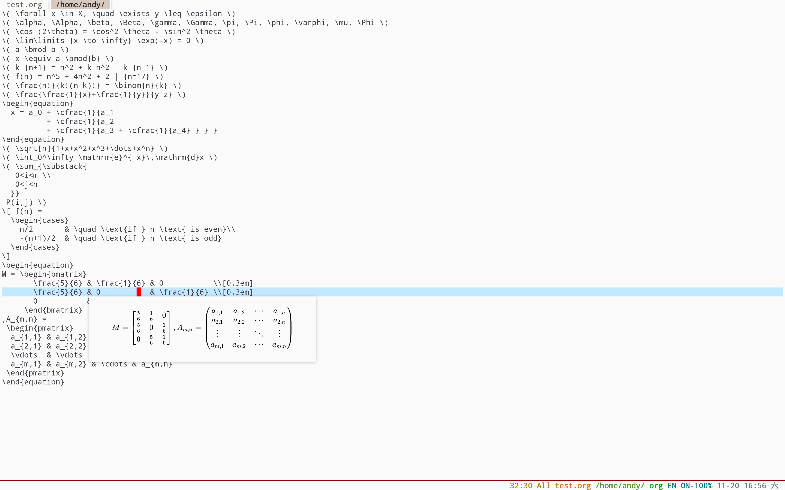

# popweb
I always wanted a fast and responsive pop-up window to display multimedia content in Emacs, this includes web translation tooltip, LaTeX preview for math equations, code completion, etc. The creation and success of the [Emacs Application Framework](https://github.com/emacs-eaf/emacs-application-framework) gave a solid foundation for this to happen. Therefore I consider `popweb` to be a sister project, a lightweight version from the EAF that precisely focuses on popup functionality, where some portion of code is shared between the two projects.

## Installation
1. Make sure install PyQt5 from your operating system repository (DON'T install PyQt5 from pip, otherwise browser will crash). (Pro tip, the [EAF installer](https://github.com/emacs-eaf/emacs-application-framework) handles step 1 & 2 already!)
2. Install library [python-epc](https://github.com/tkf/python-epc) by ```pip install epc```
3. Clone or download this repository (path of the folder is the `<path-to-popweb>` used below).
4. In your `~/.emacs`, add the following lines:
```elisp
(add-to-list 'load-path "<path-to-popweb>") ; add popweb to your load-path

;; LaTeX preview functionality
(add-to-list 'load-path "<path-to-popweb>/extension/latex")
(require 'popweb-latex)
(add-hook 'latex-mode-hook #'popweb-latex-mode)

;; Chinese-English translation popup
(add-to-list 'load-path "<path-to-popweb>/extension/dict") ;
(require 'popweb-dict-bing) ; Translation using Bing
(require 'popweb-dict-youdao) ; Translation using YouDao
```

## Usage
* `popweb-latex-mode`: LaTeX math equations preview in `org-mode` and `latex-mode`.
* `M-x popweb-dict-bing-pointer`: Translation at point with Bing
* `M-x popweb-dict-bing-input`: Translation given an input with Bing
* `M-x popweb-dict-youdao-pointer`: Translation at point with Youdao
* `M-x popweb-dict-youdao-input`: Translation given an input with YouDao

## Customization
- Configure popup position using `popweb-popup-pos`:
  - `"point-bottom"`: bottom of the cursor, default
  - `"point-bottom-right"`: bottom-right of the cursor
  - `"top-left"`: top-left of the screen
  - `"top-right"`: top-right of the screen
  - `"bottom-left"`: bottom-left: of the screen
  - `"bottom-right"`: bottom-right of the screen

## Proxy
If you need to use a proxy to access the internet, one can configure the proxy settings.

```Elisp
(setq popweb-proxy-type "http")
(setq popweb-proxy-host "127.0.0.1")
(setq popweb-proxy-port "1080")
```

If you use Socks5 as a local proxy, one can set proxy type with:

```Elisp
(setq popweb-proxy-type "socks5")
```

# Screenshot
## Popweb with Bing translation.
<p align="center">
  
</p>

## Popweb with Youdao translation.
<p align="center">
  
</p>

## Popweb with LaTeX Preview.
<p align="center">
  
</p>

## Report bug
Please use `emacs -q` and load a minimal setup with only popweb to verify that the bug is reproducible. If `emacs -q` works fine, probably something is wrong with your Emacs config.

If the problem persists, please report it [here](https://github.com/manateelazycat/popweb/issues/new) with `*popweb*` buffer content, it contains many clues that can help us locate the problem faster.

If you get a segfault error, please use the following way to collect crash information:
1. Install gdb and turn on option `popweb-enable-debug`
2. Use the command `popweb-stop-process` to stop the current process
3. Restart popweb, send issue with `*popweb*` buffer content when next crash

## Contributor
<a href = "https://github.com/manateelazycat/popweb/graphs/contributors">
  
</a>
