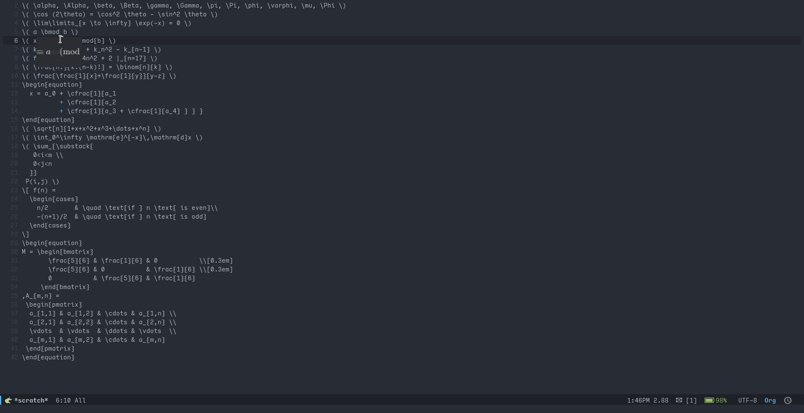
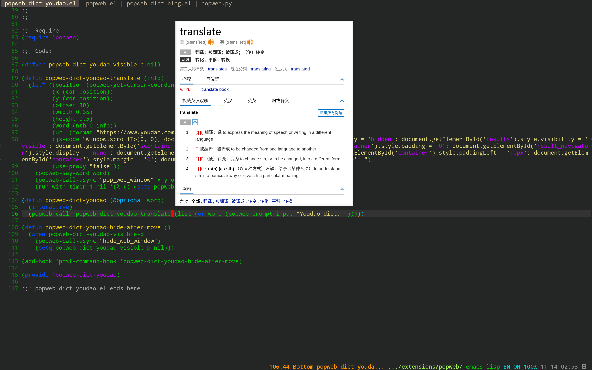
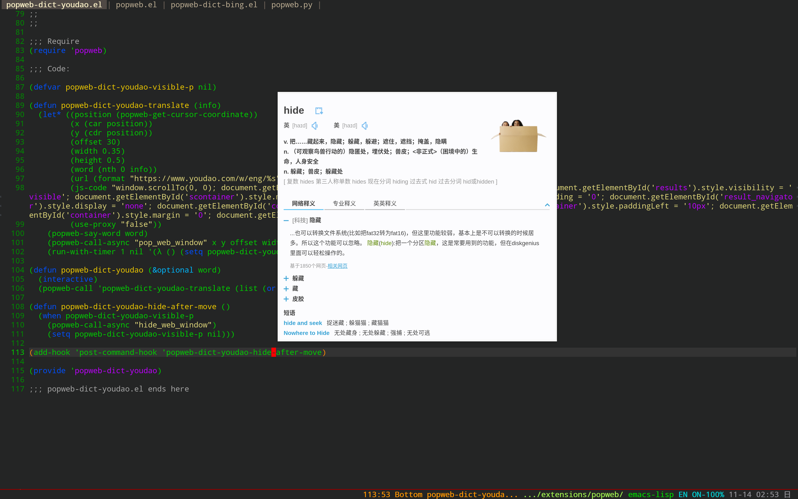
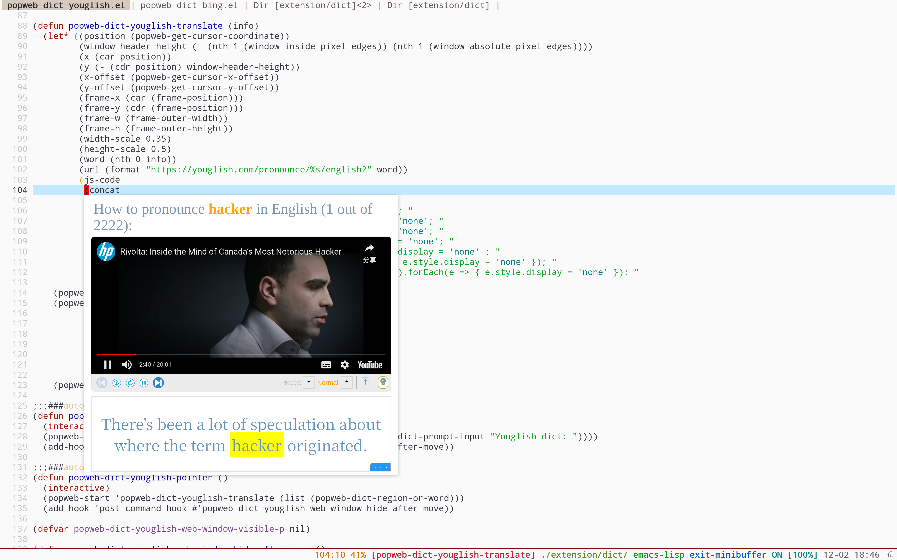
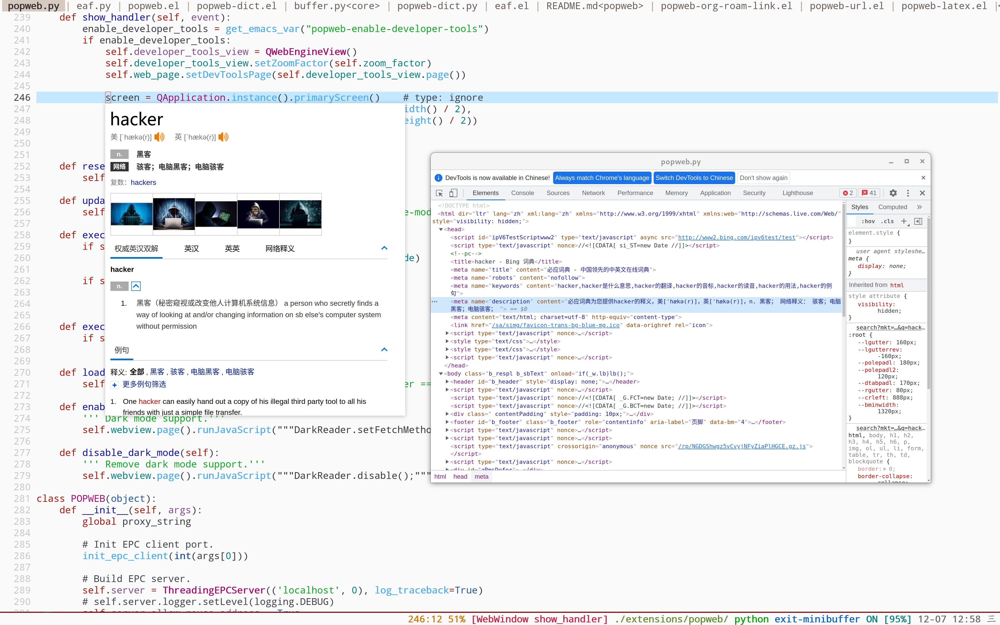

# popweb
I always wanted a fast and responsive pop-up window to display multimedia content in Emacs, this includes web translation tooltip, LaTeX preview for math equations, code completion, color picker, etc. The creation and success of the [Emacs Application Framework](https://github.com/emacs-eaf/emacs-application-framework) gave a solid foundation for this to happen.

I consider `popweb` to be a sister project, and a lightweight version of EAF that particularly focuses on multimedia popup functionality, some portion of code is shared between the two projects.

## Installation
1. Install PyQt6: ```pip install PyQt6 PyQt6-Qt6 PyQt6-sip PyQt6-WebEngine PyQt6-WebEngine-Qt6```
2. Install [python-epc](https://github.com/tkf/python-epc): ```pip install epc sexpdata```
3. Install [browser_cookie3](https://github.com/borisbabic/browser_cookie3)(optional, for import cookies from browser): ```pip install browser_cookie3```
4. Clone or download this repository (path of the folder is the `<path-to-popweb>` used below).
5. In your `~/.emacs`, add the following lines:
```elisp
(add-to-list 'load-path "<path-to-popweb>") ; add popweb to your load-path

;; Org-Roam ID link and footnote link previewer
(add-to-list 'load-path "<path-to-popweb>/extension/org-roam")
(require 'popweb-org-roam-link)

;; LaTeX preview functionality
(add-to-list 'load-path "<path-to-popweb>/extension/latex")
(require 'popweb-latex)
(add-hook 'latex-mode-hook #'popweb-latex-mode)

;; Chinese-English translation popup
(add-to-list 'load-path "<path-to-popweb>/extension/dict") ;
(require 'popweb-dict) 
```

## Usage
* `popweb-latex-mode`: LaTeX math equations preview in `org-mode` and `latex-mode`.
* `M-x popweb-dict-bing-pointer`: Translation at point with Bing
* `M-x popweb-dict-bing-input`: Translation given an input with Bing
* `M-x popweb-dict-youdao-pointer`: Translation at point with Youdao
* `M-x popweb-dict-youdao-input`: Translation given an input with Youdao
* `M-x popweb-dict-youglish-pointer`: Translation at point with youglish.com
* `M-x popweb-dict-youglish-input`: Translation given an input with youglish.com
* `M-x popweb-dict-dictcn-pointer`: Translation at point with dict.cn
* `M-x popweb-dict-dictcn-input`: Translation given an input with dict.cn
* `M-x popweb-org-roam-link-show`: Preview Org-Roam ID link or footnote link at point.
* `M-x popweb-org-roam-link-preview-select` Select one of all Org-Roam ID links and footnote links in a Org-mode buffer by ivy, then preview the content of link.
* `M-x popweb-org-roam-node-preview-select` Select one Org-Roam node by ivy, then hit `C-M-m ivy-call` to preview the content of node without exit ivy windown.
* `M-x popweb-import-browser-cookies` Import cookies for the specified domain name.
## Screenshots
### LaTeX Preview
<p align="center">
  
</p>

### Bing Translation
<p align="center">
  
</p>

### Youdao Translation
<p align="center">
  
</p>

### Youglish Translation
<p align="center">
  
</p>

### Org-Roam ID link and footnote link Preview
<p align="center">
  
</p>

### Org-Roam node preview
<p align="center">
  
</p>

## Customization
### Configure popup position using `popweb-popup-pos`
  - `"point-bottom"`: bottom of the cursor, default
  - `"point-bottom-right"`: bottom-right of the cursor
  - `"top-left"`: top-left of the screen
  - `"top-right"`: top-right of the screen
  - `"bottom-left"`: bottom-left: of the screen
  - `"bottom-right"`: bottom-right of the screen

### Proxy
If you need to use a proxy to access the internet, one can configure the proxy settings.

```Elisp
(setq popweb-proxy-type "http")
(setq popweb-proxy-host "127.0.0.1")
(setq popweb-proxy-port "1080")
```

If you use Socks5 as a local proxy, one can set proxy type with:

```Elisp
(setq popweb-proxy-type "socks5")
```

### Font size
If you think the font of popup web page is too small, you can change value of `popweb-zoom-factor`.

```Elisp
(setq popweb-zoom-factor 1.5)
```

### Configure Org-Roam link popup window size
```
(setq popweb-org-roam-link-popup-window-width-scale 0.8)
(setq popweb-org-roam-link-popup-window-height-scale 0.5)
```
Popup window scales to Emacs's.

## Configure Url-Preivew popup window size
You can choose either scaled to emacs or in pixes by customizing
```
(setq popweb-url-web-window-size-use-absolute t)
```
### Scaled to emacs
```
(setq popweb-url-web-window-width-scale 0.8)
(setq popweb-url-web-window-height-scale 0.45)
```
Popup window scales to Emacs's.
### Absolute
```
(setq popweb-url-web-window-width-absolute 480)
(setq popweb-url-web-window-height-absolute 270)
```
Popup window's size in pixels

## Open developer tools
You can set option `popweb-enable-developer-tools` with `t`, then you can debug popweb page like normal browser does.

<p align="center">
  
</p>

## Report bug
Please use `emacs -q` and load a minimal setup with only popweb to verify that the bug is reproducible. If `emacs -q` works fine, probably something is wrong with your Emacs config.

If the problem persists, please report it [here](https://github.com/manateelazycat/popweb/issues/new) with `*popweb*` buffer content, it contains many clues that can help us locate the problem faster.

If you get a segfault error, please use the following way to collect crash information:
1. Install gdb and turn on option `popweb-enable-debug`
2. Use the command `popweb-stop-process` to stop the current process
3. Restart popweb, send issue with `*popweb*` buffer content when next crash

## Contributor
<a href = "https://github.com/manateelazycat/popweb/graphs/contributors">
  
</a>
